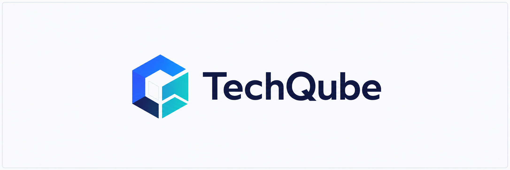
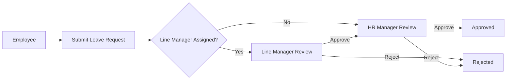
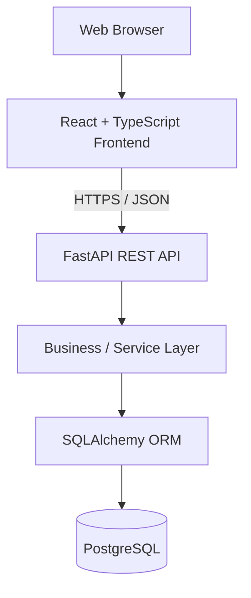
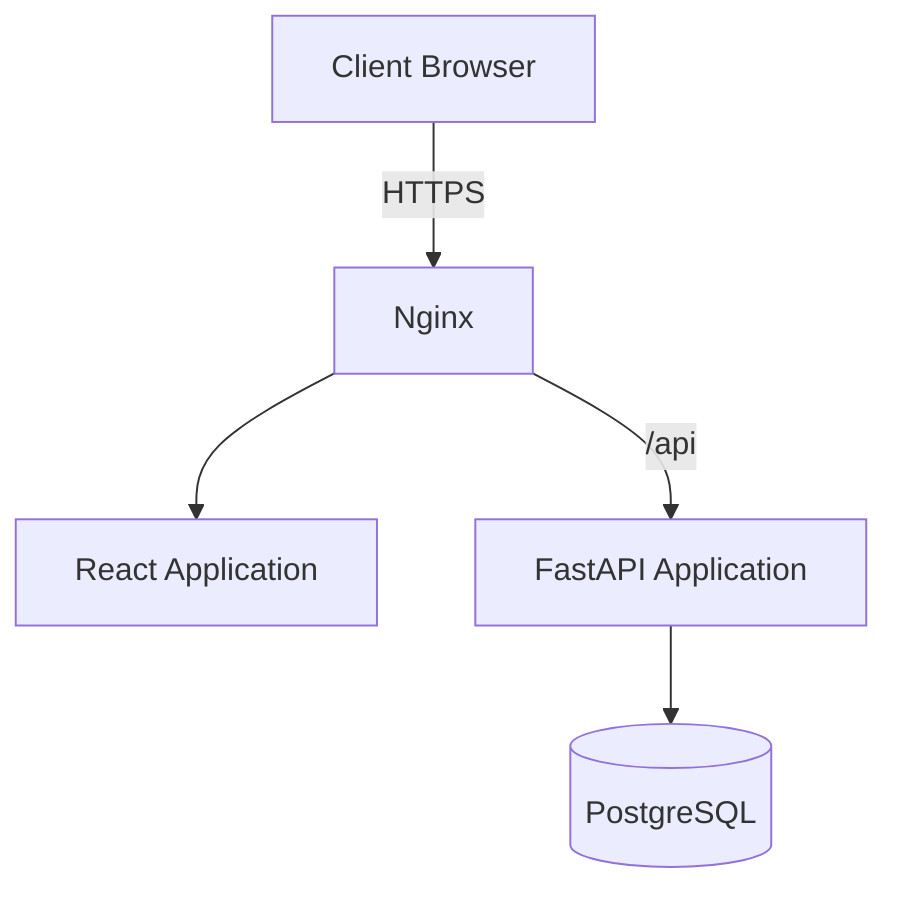
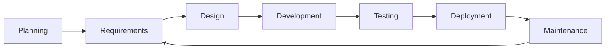
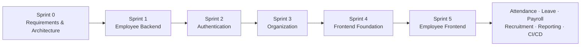

<p align="center">
  
</p>

<h1 align="center">TechQube HRM</h1>

<p align="center">
  <strong>Modern, multi-company Human Resource Management platform</strong>
</p>

<p align="center">
  React · TypeScript · FastAPI · PostgreSQL · Docker
</p>

---

## Overview

**TechQube HRM** is a web-based Human Resource Management platform designed to centralize and streamline HR operations across one or more companies.

The platform is being developed around practical HR workflows including:

- Employee management
- Multi-company operations
- Organization structure
- Attendance
- Leave management
- Multi-level approvals
- Configurable payroll
- Recruitment
- Employee and manager self-service
- Dashboards and analytics
- Operational and PDF reporting
- Role-based access control
- Auditability

The project follows a structured software engineering lifecycle covering requirements analysis, system design, implementation, testing, deployment, and ongoing maintenance.

---

## Product Vision

TechQube HRM aims to provide organizations with a maintainable and extensible HR platform that supports day-to-day HR operations without tightly coupling business rules to application source code.

Key design goals include:

- Multi-company capability
- Configurable HR policies
- Secure role-based access
- Employee self-service
- Manager approval workflows
- Configurable payroll rules
- Clear audit history
- Operational dashboards
- Printable business reports
- Modular architecture
- API-driven frontend/backend separation

---

## Core Functional Areas

| Area | Scope |
|---|---|
| Multi-Company | Company-specific employees, departments, payroll, leave, attendance and reporting |
| Employee Management | Employee profiles, employment data, hierarchy, archive/history |
| Organization | Departments, job positions, line managers and reporting relationships |
| Employee Self-Service | Profile, attendance, leave, payslips and personal dashboard |
| Manager Self-Service | Team visibility, attendance review and approvals |
| Attendance | Web check-in/out, manual entry, worked hours and attendance reporting |
| Leave | Leave types, allocations, balances, requests and multi-level approvals |
| Payroll | Salary structures, configurable salary rules, calculations, payslips and payroll reporting |
| Recruitment | Vacancies, candidates, recruitment stages, interviews and hiring |
| Reporting | Dashboard KPIs, operational reports and PDF documents |
| Security | Authentication, roles, permissions, company restrictions and audit controls |

---

## Approval Workflow

The default leave approval process is:



The workflow architecture is intended to support future configuration and additional approval scenarios.

---

## Technology Stack

### Frontend

| Technology | Purpose |
|---|---|
| React | Web user interface |
| TypeScript | Type-safe frontend development |
| Vite | Frontend build and development tooling |
| Tailwind CSS | UI styling |

### Backend

| Technology | Purpose |
|---|---|
| Python | Backend programming language |
| FastAPI | REST API framework |
| Pydantic | Request and response validation |
| SQLAlchemy | ORM and database access |

### Data

| Technology | Purpose |
|---|---|
| PostgreSQL | Primary relational database |

### Infrastructure

| Technology | Purpose |
|---|---|
| Docker | Application containerization |
| Docker Compose | Local service orchestration |
| Nginx | Planned reverse proxy / production web layer |

### Engineering Tooling

| Technology | Purpose |
|---|---|
| Git | Source control |
| GitHub | Repository management and collaboration |
| Pytest | Planned backend automated testing |
| GitHub Actions | Planned CI/CD |

---

## High-Level Architecture



The frontend and backend are intentionally separated through REST APIs.

This allows each layer to evolve independently while maintaining a defined API contract.

---

## Planned Production Architecture



Production architecture will be refined in the dedicated architecture and deployment documents.

---

## Repository Structure

```text
hrm-fullstack/
│
├── backend/
│   ├── app/
│   │   ├── models/
│   │   ├── routers/
│   │   ├── schemas/
│   │   ├── services/
│   │   ├── database.py
│   │   └── main.py
│   │
│   ├── Dockerfile
│   └── requirements.txt
│
├── frontend/
│
├── docs/
│   ├── assets/
│   ├── BRD.md
│   ├── User-Stories.md
│   └── FRD.md
│
├── docker-compose.yml
├── .gitignore
└── README.md
```

The structure will evolve as architecture and implementation progress.

---

## Project Documentation

Requirements and design documentation are maintained separately from implementation code.

| Document | Purpose | Status |
|---|---|---|
| [BRD](docs/BRD.md) | Business Requirements Document | ✅ Approved v1.0 |
| [User Stories](docs/User-Stories.md) | Agile product backlog / user requirements | 🟡 Draft |
| [FRD](docs/FRD.md) | Functional Requirements Document | 🟡 Draft |
| SRS | Software Requirements Specification | ⏳ Planned |
| Architecture | System architecture and technical decisions | ⏳ Planned |
| Database Design | Data model and ERD | ⏳ Planned |
| API Specification | REST API contract | ⏳ Planned |
| Security | Authentication, authorization and security design | ⏳ Planned |
| Traceability Matrix | BR → US → FR → Test traceability | ⏳ Planned |
| Sprint Backlog | Sprint planning and implementation tasks | ⏳ Planned |
| Deployment | Deployment and operational procedures | ⏳ Planned |

---

## Requirements Traceability

Requirements are intended to remain traceable throughout the development lifecycle.

```text
Business Requirement
        │
        ▼
User Story
        │
        ▼
Functional Requirement
        │
        ▼
Technical Design
        │
        ▼
Implementation
        │
        ▼
Test Case
```

Example:

```text
BR-002
Employee Management
        ↓
US-EMP-001
Create Employee
        ↓
FR-EMP-001
Employee Creation
        ↓
API + Database + UI
        ↓
Test Cases
```

A formal traceability matrix will be maintained as implementation progresses.

---

## Development Methodology

The project follows an **Agile iterative development model within a structured SDLC**.

The overall lifecycle is:



Features are implemented incrementally through defined backlog items and sprint objectives.

---

## Agile Workflow

Each development item should progress through:

```text
Business Requirement
        ↓
User Story
        ↓
Acceptance Criteria
        ↓
Refinement
        ↓
Sprint Planning
        ↓
Development
        ↓
Testing
        ↓
Code Review
        ↓
Merge
```

A feature should meet the project's **Definition of Done** before it is considered complete.

---

## Git Workflow

Development will follow a branch-based workflow.

```text
main
 │
 └── develop
      │
      ├── feature/authentication
      ├── feature/employee-management
      ├── feature/organization
      ├── feature/attendance
      ├── feature/leave-management
      ├── feature/payroll
      └── feature/reporting
```

### `main`

Represents stable project baselines.

### `develop`

Integration branch for completed development work.

### `feature/*`

Used for isolated feature development.

Example:

```bash
git checkout -b feature/employee-management
```

After implementation:

```bash
git add .
git commit -m "feat: add employee management API"
git push -u origin feature/employee-management
```

Changes should be reviewed before merging into the integration branch.

---

## Commit Convention

The project uses descriptive commit prefixes.

```text
feat:      new application functionality
fix:       bug correction
docs:      documentation change
test:      test additions or updates
refactor:  internal code restructuring
chore:     tooling or maintenance work
ci:        CI/CD configuration
build:     build or dependency changes
```

Examples:

```text
docs: finalize business requirements v1.0
feat: add employee creation endpoint
fix: prevent duplicate employee identifiers
test: add employee API validation tests
refactor: move employee logic to service layer
chore: update Docker configuration
```

---

## Development Environment

The project currently uses Docker Compose for backend and database services.

### Clone

```bash
git clone git@github.com:codesWithRifat/hrm-fullstack.git
```

```bash
cd hrm-fullstack
```

### Build Services

```bash
docker compose up -d --build
```

### Check Services

```bash
docker compose ps
```

### Backend API

```text
http://localhost:8040
```

### Swagger / OpenAPI UI

```text
http://localhost:8040/docs
```

### ReDoc

```text
http://localhost:8040/redoc
```

---

## Development Commands

### Backend logs

```bash
docker compose logs -f backend
```

### PostgreSQL logs

```bash
docker compose logs -f db
```

### Restart backend

```bash
docker compose restart backend
```

### Enter backend container

```bash
docker exec -it hrm_backend bash
```

### Enter PostgreSQL

```bash
docker exec -it hrm_db psql -U hrm -d hrm
```

### Stop environment

```bash
docker compose down
```

### Start environment

```bash
docker compose up -d
```

### Rebuild

```bash
docker compose up -d --build
```

---

## API Design Direction

The backend will expose versioned REST APIs.

Base convention:

```text
/api/v1
```

Planned resource groups include:

```text
/api/v1/auth
/api/v1/companies
/api/v1/users
/api/v1/employees
/api/v1/departments
/api/v1/job-positions
/api/v1/attendance
/api/v1/leave-types
/api/v1/leave-requests
/api/v1/payroll
/api/v1/recruitment
/api/v1/reports
```

The full request/response contract will be maintained in the API specification.

---

## Reporting Strategy

Reporting will be implemented in three layers:

```text
Dashboard / KPI
      ↓
Interactive Report
      ↓
Printable / Downloadable PDF
```

Examples include:

- Employee headcount
- Attendance summary
- Leave utilization
- Payroll summary
- Department workforce
- Recruitment pipeline

Reports must respect the same company and user authorization rules as normal application records.

---

## Payroll Design Direction

Payroll will be based on **configurable salary rules** rather than fixed salary fields.

Conceptually:

```text
Salary Structure
│
├── Basic Salary
├── House Rent
├── Medical Allowance
├── Overtime
├── Bonus
├── Tax
├── Provident Fund
├── Other Deductions
└── Custom Rules
```

Authorized payroll users will be able to configure applicable rules without requiring source-code modifications for every new salary component.

Detailed calculation design will be finalized during payroll architecture and database design.

---

## Security Principles

The application will follow several core security principles:

- Backend-enforced authorization
- Role-based permissions
- Company-level data restrictions
- Secure password hashing
- Protected API endpoints
- Input validation
- Least-privilege access
- Restricted payroll data
- Restricted sensitive employee data
- Auditability of important business actions
- Secrets excluded from source control

Detailed security requirements will be maintained separately.

---

## Testing Strategy

Testing will be introduced progressively.

### Backend

- Unit tests
- API tests
- Validation tests
- Authorization tests
- Business-rule tests

### Frontend

- Component tests
- Form validation
- User interaction tests

### Integration

- Frontend ↔ API
- API ↔ Database
- Authentication workflows
- Approval workflows
- Payroll calculations

Critical workflows should be covered by automated tests before production deployment.

---

## Definition of Done

A feature is considered complete when applicable requirements are satisfied:

- User story refined
- Acceptance criteria met
- Backend implementation complete
- Frontend implementation complete
- Validation implemented
- Authorization implemented
- Automated tests passing
- Integration verified
- Documentation updated
- Code reviewed
- No unresolved critical defects
- Changes merged through the agreed Git workflow

---

## Current Status

**Phase:** Requirements & Design  
**Current Sprint:** Sprint 0 — Project Foundation

| Item | Status |
|---|---|
| Repository setup | ✅ Complete |
| Git / GitHub setup | ✅ Complete |
| Docker foundation | ✅ Complete |
| PostgreSQL development service | ✅ Complete |
| FastAPI foundation | ✅ Complete |
| TechQube branding | ✅ Complete |
| Project README | ✅ Complete |
| Business Requirements (BRD) | ✅ Approved v1.0 |
| User Story Catalog | 🟡 Draft |
| Functional Requirements (FRD) | 🟡 Draft |
| Documentation normalization | 🔄 In Progress |
| SRS | ⏳ Planned |
| Architecture Design | ⏳ Planned |
| Database ERD | ⏳ Planned |
| API Specification | ⏳ Planned |
| Sprint 1 Development | ⏳ Planned |

---

## Delivery Roadmap



The roadmap may be adjusted through backlog refinement as architecture and requirements mature.

---

## Engineering Principles

The project prioritizes:

- Clear requirements
- Separation of concerns
- Maintainability
- Explicit business logic
- Secure defaults
- Database integrity
- API consistency
- Testability
- Traceability
- Incremental delivery
- Documentation aligned with implementation

Complexity should be introduced only when justified by requirements.

---

## Project Purpose

TechQube HRM is being developed both as a functional HR platform and as an end-to-end software engineering implementation covering the complete delivery lifecycle.

The project deliberately includes requirements engineering, architecture, application development, testing, DevOps and deployment practices so that engineering decisions can be understood and implemented rather than hidden behind generated application code.

---

## Brand

**Organization:** TechQube  
**Product:** TechQube HRM  
**Current Development Domain:** `erpedge.xyz`

### Brand Palette

| Purpose | Color |
|---|---|
| Primary | `#2563EB` |
| Dark Navy | `#0F172A` |
| Accent | `#14B8A6` |
| Background | `#F8FAFC` |
| Success | `#22C55E` |
| Warning | `#F59E0B` |
| Error | `#EF4444` |

---

## Maintainer

**Rifat**

Project Owner / Developer

---

<p align="center">
  <strong>TechQube HRM</strong>
</p>

<p align="center">
  Modern HR operations. Structured engineering.
</p>