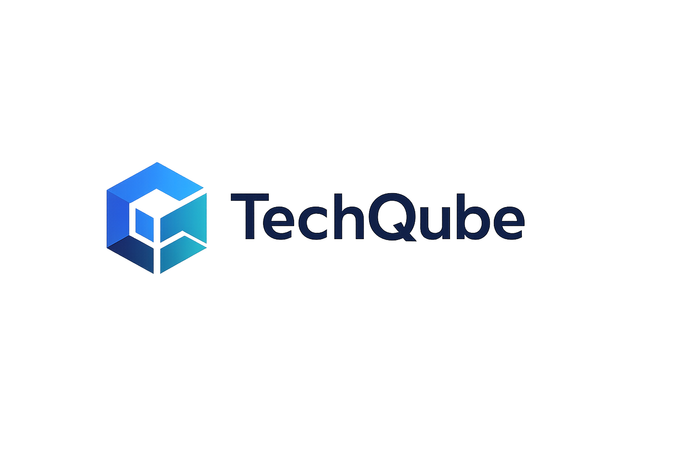

<p align="center">
  
</p>

<h1 align="center">TechQube HRM</h1>

<p align="center">
  A full-stack Human Resource Management system built as a complete software engineering learning project.
</p>

<p align="center">
  <strong>Planning → Requirements → Design → Development → Testing → Deployment</strong>
</p>

---

## Overview

**TechQube HRM** is a web-based Human Resource Management system being developed to practice the complete lifecycle of a modern full-stack software project.

The project is intentionally being built step by step instead of jumping directly into application development.

The goal is to practice:

- Software Development Life Cycle (SDLC)
- Agile development
- Business requirements analysis
- Functional requirements analysis
- Software requirements specification
- System architecture
- Database design
- REST API development
- Frontend development
- Authentication and authorization
- Testing
- Git and GitHub workflow
- Docker
- CI/CD
- Deployment
- Maintenance and future improvements

This project will evolve incrementally from documentation and planning into a complete HRM platform.

---

## Project Goals

The primary goals of this project are:

1. Build a real-world full-stack HRM application.
2. Improve Python and backend development skills.
3. Learn FastAPI.
4. Learn React and TypeScript.
5. Practice PostgreSQL and relational database design.
6. Practice REST API design.
7. Learn frontend-backend integration.
8. Practice authentication and authorization.
9. Learn professional Git and GitHub workflows.
10. Practice Agile and SDLC processes.
11. Use Docker for local development and deployment.
12. Implement automated testing.
13. Learn CI/CD.
14. Deploy the project to a production-like environment.

---

## Learning Philosophy

This project is being built as a learning exercise.

The development process follows these principles:

- Understand the requirement before writing code.
- Design before implementation.
- Write code manually whenever possible.
- Use AI as a reviewer and learning assistant rather than replacing programming practice.
- Commit changes in logical milestones.
- Document important technical decisions.
- Build features in small iterations.
- Refactor when understanding improves.

---

## Planned Technology Stack

### Frontend

- React
- TypeScript
- Tailwind CSS
- Vite

### Backend

- Python
- FastAPI
- SQLAlchemy
- Pydantic

### Database

- PostgreSQL

### Authentication

Planned:

- Password hashing
- JWT authentication
- Role-based access control

### Infrastructure

- Docker
- Docker Compose
- Nginx

### Version Control

- Git
- GitHub

### Testing

Planned:

- Pytest
- FastAPI API tests
- Frontend component tests
- Integration tests

### DevOps

Planned:

- GitHub Actions
- CI/CD
- Docker-based production deployment

---

## High-Level Architecture

```text
┌─────────────────────────────────────┐
│                                     │
│          React Frontend             │
│          TypeScript                 │
│                                     │
└──────────────────┬──────────────────┘
                   │
                   │ HTTP / HTTPS
                   │ REST / JSON
                   ▼
┌─────────────────────────────────────┐
│                                     │
│            FastAPI API              │
│              Python                 │
│                                     │
└──────────────────┬──────────────────┘
                   │
                   │ SQLAlchemy ORM
                   │
                   ▼
┌─────────────────────────────────────┐
│                                     │
│            PostgreSQL               │
│             Database                │
│                                     │
└─────────────────────────────────────┘
```

Future production architecture may include:

```text
Internet
   │
   ▼
Nginx
   │
   ├──────────────► React Frontend
   │
   └──────────────► FastAPI Backend
                         │
                         ▼
                    PostgreSQL
```

---

## Planned HRM Modules

### Core System

- Dashboard
- Authentication
- User Management
- Roles
- Permissions
- Application settings

### Employee Management

- Employee creation
- Employee profile
- Employee update
- Employee archive / activation
- Employee search
- Employee filtering
- Employee documents
- Emergency contacts
- Employment information

### Organization Management

- Departments
- Job positions
- Managers
- Reporting hierarchy
- Work locations

### Attendance

- Check-in
- Check-out
- Daily attendance
- Working hours
- Late attendance
- Attendance history
- Attendance reports

### Leave Management

- Leave types
- Leave allocation
- Leave requests
- Leave approval
- Leave rejection
- Leave balances
- Leave history

### Payroll

Planned later in the project:

- Salary structure
- Basic salary
- Allowances
- Deductions
- Payroll processing
- Payslip generation
- Payroll history

### Recruitment

- Job vacancies
- Candidates
- Applications
- Recruitment stages
- Interview tracking
- Hiring status

### Reporting

- Employee reports
- Attendance reports
- Leave reports
- Payroll reports
- Dashboard statistics

---

## Software Development Life Cycle

This project follows the SDLC process.

```text
Planning
   │
   ▼
Requirements Analysis
   │
   ▼
System Design
   │
   ▼
Development
   │
   ▼
Testing
   │
   ▼
Deployment
   │
   ▼
Maintenance
```

Each phase will be documented as the project develops.

---

## Project Documentation

Project documentation is maintained inside the `docs/` directory.

Planned structure:

```text
docs/
│
├── assets/
│   └── TechQube-logo.png
│
├── BRD.md
├── FRD.md
├── SRS.md
├── Architecture.md
├── Database.md
├── API.md
├── Security.md
├── User-Stories.md
├── Sprint-Backlog.md
├── UI-UX.md
└── Deployment.md
```

---

## Requirements Documentation

### Business Requirements Document — BRD

The BRD will define:

- Business problem
- Business objectives
- Stakeholders
- Business scope
- Business processes
- High-level requirements
- Business constraints
- Success criteria

---

### Functional Requirements Document — FRD

The FRD will describe:

- Application modules
- User interactions
- Workflows
- Functional behavior
- Business rules
- Validation rules
- Permissions
- Approval flows

---

### Software Requirements Specification — SRS

The SRS will describe:

- Functional requirements
- Non-functional requirements
- Performance requirements
- Security requirements
- Availability requirements
- System constraints
- API behavior
- Data requirements

---

## Agile Development

Development will follow an Agile-inspired iterative approach.

Features will be implemented in small sprints.

Each feature should ideally include:

- User Story
- Acceptance Criteria
- Development Tasks
- Testing Tasks
- Definition of Done

---

## User Story Example

```text
As an HR Manager,
I want to create a new employee,
so that employee information can be managed in the HRM system.
```

### Acceptance Criteria

```text
Given I am an authorized HR Manager

When I open the employee creation page
And enter valid employee information
And submit the form

Then the employee should be saved
And the employee should appear in the employee list
And a success message should be displayed
```

---

## Sprint Roadmap

### Sprint 0 — Project Foundation

Goals:

- Project planning
- Git repository setup
- GitHub repository setup
- Docker environment
- FastAPI initialization
- PostgreSQL container
- Branding
- README
- BRD
- FRD
- SRS
- Architecture planning
- Initial database planning
- Initial API planning

---

### Sprint 1 — Employee Management Backend

Planned tasks:

- Employee database model
- Employee schema
- Create employee API
- List employees API
- Get employee API
- Update employee API
- Delete/archive employee API
- Input validation
- API testing

---

### Sprint 2 — Authentication

Planned tasks:

- User model
- Password hashing
- Login endpoint
- JWT token generation
- Authenticated routes
- Current user endpoint
- Basic access control

---

### Sprint 3 — Organization Management

Planned tasks:

- Department model
- Job position model
- Department API
- Job position API
- Assign department to employee
- Assign job position to employee

---

### Sprint 4 — Frontend Foundation

Planned tasks:

- React setup
- TypeScript setup
- Tailwind CSS setup
- Application layout
- Navigation
- Login page
- Dashboard layout
- API client setup

---

### Sprint 5 — Employee Frontend

Planned tasks:

- Employee list
- Employee form
- Employee details
- Employee editing
- Search
- Filters
- Pagination

---

### Future Sprints

Planned:

- Leave Management
- Attendance
- Payroll
- Recruitment
- Reporting
- Role-based permissions
- Automated testing
- CI/CD
- Production deployment

---

## Current Project Structure

```text
hrm-fullstack/
│
├── backend/
│   │
│   ├── app/
│   │   ├── models/
│   │   ├── routers/
│   │   ├── schemas/
│   │   ├── services/
│   │   ├── __init__.py
│   │   ├── database.py
│   │   └── main.py
│   │
│   ├── Dockerfile
│   └── requirements.txt
│
├── frontend/
│
├── docs/
│   └── assets/
│       └── TechQube-logo.png
│
├── docker-compose.yml
├── .gitignore
├── README.md
└── LICENSE
```

The folder structure will evolve as the project grows.

---

## Backend Structure

The FastAPI backend is planned around separation of responsibilities.

```text
backend/app/
│
├── models/
│   └── Database models
│
├── schemas/
│   └── Request and response schemas
│
├── routers/
│   └── API endpoints
│
├── services/
│   └── Business logic
│
├── database.py
│   └── Database connection
│
└── main.py
    └── FastAPI application entry point
```

---

## REST API Design

Planned API structure:

```text
/api/v1/
```

Example endpoints:

```text
GET     /api/v1/employees
POST    /api/v1/employees
GET     /api/v1/employees/{id}
PUT     /api/v1/employees/{id}
DELETE  /api/v1/employees/{id}
```

Additional resources will follow a similar REST structure.

---

## Database

PostgreSQL will be used as the main relational database.

Main planned entities include:

```text
Users
Employees
Departments
Job Positions
Attendance
Leave Types
Leave Requests
Payroll
Recruitment
```

A complete ERD will be created before implementing major database relationships.

---

## Docker Development Environment

The project uses Docker Compose to provide a consistent development environment.

Planned containers:

```text
hrm_backend
hrm_db
hrm_frontend
```

Future production architecture may also include:

```text
nginx
```

---

## Running the Project

### Clone

```bash
git clone git@github.com:codesWithRifat/hrm-fullstack.git
```

### Enter the project

```bash
cd hrm-fullstack
```

### Environment configuration

Create an environment file:

```bash
cp .env.example .env
```

Update the values as required.

### Build and start

```bash
docker compose up -d --build
```

### Check containers

```bash
docker compose ps
```

### Backend

```text
http://localhost:8040
```

### FastAPI Swagger Documentation

```text
http://localhost:8040/docs
```

### FastAPI ReDoc

```text
http://localhost:8040/redoc
```

---

## Useful Docker Commands

View backend logs:

```bash
docker compose logs -f backend
```

View database logs:

```bash
docker compose logs -f db
```

Restart backend:

```bash
docker compose restart backend
```

Enter backend container:

```bash
docker exec -it hrm_backend bash
```

Enter PostgreSQL:

```bash
docker exec -it hrm_db psql -U hrm -d hrm
```

Stop containers:

```bash
docker compose down
```

Start containers:

```bash
docker compose up -d
```

Rebuild:

```bash
docker compose up -d --build
```

---

## Git Workflow

The project uses Git for version control.

### Recommended Branches

```text
main
│
└── develop
    │
    ├── feature/employee-management
    ├── feature/authentication
    ├── feature/departments
    ├── feature/attendance
    ├── feature/leave-management
    └── feature/payroll
```

### Main

Stable application code.

### Develop

Integration branch for development work.

### Feature Branches

Used for individual features.

Example:

```bash
git checkout -b feature/employee-management
```

After development:

```bash
git add .
git commit -m "Add employee management API"
git push -u origin feature/employee-management
```

The feature should eventually be merged through a Pull Request.

---

## Commit Style

Commits should describe meaningful changes.

Examples:

```text
docs: add business requirements document
feat: add employee creation endpoint
feat: add employee database model
fix: validate duplicate employee email
test: add employee API tests
refactor: move employee logic to service layer
chore: update Docker configuration
```

---

## Testing Strategy

Testing will be added progressively.

### Backend Testing

Planned:

- Unit tests
- API tests
- Validation tests
- Authentication tests
- Permission tests

### Frontend Testing

Planned:

- Component tests
- Form validation tests
- API integration tests

### Integration Testing

Planned:

- Frontend → API
- API → Database
- Authentication flow
- Business workflows

---

## Security Goals

Planned security practices include:

- Password hashing
- JWT authentication
- Protected routes
- Role-based permissions
- Input validation
- Environment variables for secrets
- No credentials committed to Git
- CORS configuration
- Database access restrictions
- HTTPS in production

---

## CI/CD

GitHub Actions will eventually be used for:

```text
Push / Pull Request
        │
        ▼
Linting
        │
        ▼
Automated Tests
        │
        ▼
Docker Build
        │
        ▼
Deployment
```

CI/CD will be implemented after the application reaches sufficient maturity.

---

## Definition of Done

A feature should not be considered complete simply because the code works.

A feature is considered done when appropriate criteria are satisfied:

- Requirement documented
- User story defined
- Acceptance criteria satisfied
- Code implemented
- Validation implemented
- Tests written
- Tests passing
- Code reviewed
- Documentation updated
- Git history clean
- Feature merged

---

## Project Status

🚧 **Under Active Development**

Current Phase:

**Sprint 0 — Planning and Foundation**

Current progress:

- [x] Project repository created
- [x] Git initialized
- [x] GitHub remote configured
- [x] Docker environment created
- [x] PostgreSQL container created
- [x] FastAPI backend initialized
- [x] Basic API endpoint created
- [x] TechQube branding created
- [x] Project README created
- [ ] `.env.example`
- [ ] BRD
- [ ] User stories
- [ ] FRD
- [ ] SRS
- [ ] System architecture
- [ ] Database ERD
- [ ] API standards
- [ ] Sprint 1 backlog
- [ ] Employee CRUD backend
- [ ] Authentication
- [ ] React frontend

---

## Roadmap

```text
Planning
   ↓
Requirements
   ↓
Architecture
   ↓
Database Design
   ↓
Backend API
   ↓
Authentication
   ↓
Frontend
   ↓
Integration
   ↓
Testing
   ↓
CI/CD
   ↓
Production Deployment
```

---

## Branding

### Company

**TechQube**

### Product

**TechQube HRM**

### Current Domain

`erpedge.xyz`

The domain is currently being used for development and demonstration purposes and may change later.

### Brand Colors

| Purpose | Color |
|---|---|
| Primary Blue | `#2563EB` |
| Dark Navy | `#0F172A` |
| Accent Teal | `#14B8A6` |
| Background | `#F8FAFC` |
| Success | `#22C55E` |
| Warning | `#F59E0B` |
| Error | `#EF4444` |

---

## Project Principles

The project will prioritize:

- Readability
- Maintainability
- Separation of concerns
- Reusable code
- Clear naming
- Secure defaults
- Consistent API design
- Database integrity
- Proper documentation
- Incremental development

Premature complexity will be avoided.

The architecture will evolve based on actual project requirements.

---

## Disclaimer

This project is currently a learning and portfolio project.

Features, architecture, requirements, and implementation details may change as the project evolves and new concepts are learned.

---

## Author

Developed as part of the **TechQube** software engineering learning initiative.

---

<p align="center">
  <strong>TechQube</strong>
</p>

<p align="center">
  Business Software Built for Growth
</p>

<p align="center">
  <sub>Built step by step — from requirements to production.</sub>
</p>
